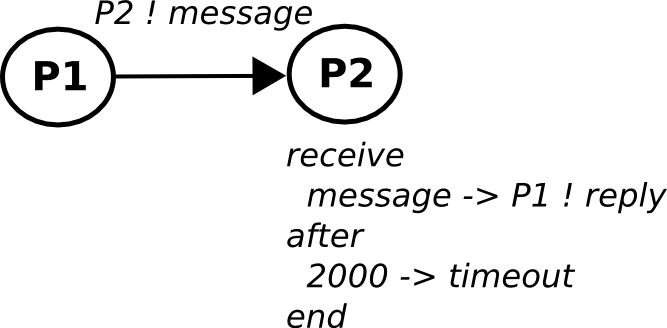

#SLIDE

<image src="http://erlang.org/images/erlang-logo.png" alt="Erlang"></image>
 
## do geeks dream of concurrent sheeps?

<small>Luca Greco &lt;luca.greco@alcacoop.it&gt;</small>

# LinuxDay2010

#SLIDE

#  Episode. 0x01

## "The Concurrent Dream"

#SLIDE

## Think "Concurrent" can be tricky...

(image from <a href="http://www.flickr.com/photos/87913776@N00/871983779/in/photostream/">futureatlas.com)</a>

#SLIDE

And if...

## SHARED MUTABLE MEMORY IS EVIL...

l

#SLIDE

Then...

## THREADING + OOP IS THE HELL

#SLIDE

## ...How to survive?

* lightweight processes
* don't share memory 
* message passing 

#SLIDE

#  Episode. 0x01
## "The Faultless Lie"

#SLIDE

## FAULT LESS IS A LIE

* bugs and fault conditions are the only truth

#SLIDE

## FAULT TOLERANT SYSTEMS PRINCIPLES:

* fail fast
* if it fail, do something simpler
* separate faults recovery from functional code

#SLIDE

# Erlang...

## WTF?!??!

#SLIDE

## Erlang...

* created at ericsson for its telco devices
* designed for concurrent / fault tolerant software

#SLIDE

## And now...

* ejabberd, couchdb, rabbitmq...
* github, processone, facebook, google, amazon...

#SLIDE

#  Episode. 0x02
## "My name is ERL"

#SLIDE

## My Name is ERL

Your Erlang best friend: *interactive shell*

<pre><code>
$ erl -sname rpl
Erlang R13B03 (erts-5.7.4) [source] [smp:2:2] [rq:2] [async-threads:0]...
Eshell V5.7.4  (abort with ^G)
(rpl@sheldon)1&gt;
</code></pre>

#SLIDE

## single assignment vars

#SLIDE

## pattern matching

#SLIDE

## Lightweight processes

#SLIDE

## Message passing

#SLIDE

## spawn and receive

<pre>
Fun = fun () ->
  receive 
    message -> io:format("received~n")
  after 2000 ->
    io:format("timeout~n")
  end
end,
Pid = spawn(Fun),
Pid ! message.
    
</pre>

#SLIDE

## receive loop

<pre>
TODO
</pre>

#SLIDE

## OTP

<pre>
TODO
</pre>