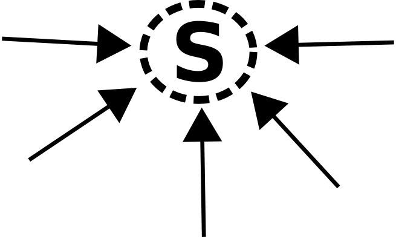

#SLIDE

<image src="http://erlang.org/images/erlang-logo.png" alt="Erlang"></image>
 
## do geeks dream of concurrent sheeps?

<small>Luca Greco &lt;luca.greco@alcacoop.it&gt;</small>

# LinuxDay2010

#SLIDE

## Erlang...

* created at ericsson for its telco devices
* designed for concurrent / fault tolerant software

#SLIDE

## And now...

* ejabberd, couchdb, rabbitmq...
* erlang solutions, basho, github, processone, facebook, google, amazon...

#SLIDE

# Ok... wait... but...

## Why should I learn erlang?!?!

#SLIDE

## Reason 0.

You can look at this page for a while...

## YOU WANT 

<iframe src="animation.html" style="width: 500px; height: 400px; border: 0;">
</iframe>

## TO LEARN ERLANG

#SLIDE

## Reason 1.

You are already using some erlang software:

* EJabberd
* CouchDB
* RabbitMQ
* ...

#SLIDE 

## Reason 2.

You are interested to learn

## how to handle concurrency

from an erlang point of view

#SLIDE

Learn the syntax is not enough

## we have to learn a new Paradigm:

* "Side Effects"-free code
* Message Passing
* Functional Patterns (map, foreach, reduce etc.) 
* Worker vs. Supervisor Processes

#SLIDE

# From Erlang...
## WTF?!??!
# To Erlang...
## FTW!!!!

<small>(<a href="http://www.erlang-factory.com/upload/presentations/219/ErlangFactorySFBay2010-JackMoffitt.pdf">
         from Jack Moffit presentation - ErlangFactorySFBay2010)</a></small>

#SLIDE

#  Episode. 0x01

## "The Concurrent Dream"

#SLIDE

## Think "Concurrent" can be tricky...

(image from <a href="http://www.flickr.com/photos/87913776@N00/871983779/in/photostream/">futureatlas.com)</a>

#SLIDE

And if...

## SHARED MUTABLE MEMORY IS EVIL...

l

#SLIDE

Then...

## THREADING + OOP IS THE HELL

#SLIDE

Ok... admit it!!!

## WE DON'T KNOW
 
## HOW CONCURRENT 

## OUR APPLICATIONS

## WILL BE

#SLIDE

## WHY?!?!?

# Object (N) <===> (M) Thread

#SLIDE

## ...How to survive?

* don't share memory
* message passing
* lightweight processes
* object => process

#SLIDE

#  Episode. 0x01
## "The Faultless Lie"

#SLIDE

## FAULT LESS IS A LIE

* bugs and fault conditions are the only truth

#SLIDE

## FAULT TOLERANT SYSTEMS PRINCIPLES:

* fail fast
* if it fail, do something simpler
* separate faults recovery from application code
* isolate faults in its process

#SLIDE

#  Episode. 0x02
## "My name is ERL"

#SLIDE

## My Name is ERL

Your Erlang best friend: *interactive shell*

<pre>
$ erl -sname rpl
Erlang R13B03 (erts-5.7.4) [source] [smp:2:2] [rq:2] [async-threads:0]...
Eshell V5.7.4  (abort with ^G)
(rpl@sheldon)1&gt;
</pre>

#SLIDE

## Erlang Basic Concepts

#SLIDE

* Code is organized into **modules**
* Module name have to match filename
* Modules are compiled into **bytecode** 
 (*mycode.erl* -> *mycode.beam*)
* Compiled modules are loaded by
  an **Erlang VM**

#SLIDE

## Erlang... punctuation

* comma separate (**","**) sequence of expressions
* semicolon (**";"**) separate clauses 
* period (**"."**) close functions, module attributes and shell expressions

#SLIDE

## MODULE: helloworld.erl

<pre>
-module(helloworld).
-export([run/0]).

run() ->
  io:format("Hello world!\n").
</pre>

#SLIDE

## BACK TO ERL: compile and run

<pre>
$ erl
Erlang R13B03 (erts-5.7.4) [source] [smp:2:2] [rq:2] [async-threads:0] [hipe] ...

Eshell V5.7.4  (abort with ^G)
1> c(helloworld).
{ok,helloworld}
2> helloworld:run().
Hello world!
ok
3> 
</pre>

#SLIDE

## Variables and datatypes

* erlang is a **loosely typed language**
* a variable can be **bound** or **unbound**
* **pattern matching** and single assignment
* datatypes: **atom, number, list, tuple, binary**

#SLIDE

## pattern matching vs. assignment

Back to erl:
<pre>
3> A = 5.
5
4>
</pre>

but...

#SLIDE

## "=" 

## is not 

## an assignment operator

#SLIDE

## pattern matching

#SLIDE

## single assignment

#SLIDE

## atom is a symbol

<pre>
1> ok.
ok
2> my_atom.
my_atom
3> 'My Atom'.
'My Atom'
</pre>

# it's not garbage collected so...
# <a href="http://learnyousomeerlang.com/starting-out-for-real#atoms">don't drink to much Kool-Aid :-P</a>
#SLIDE
 
## tuple is an immutable list

<pre>
2> Point = {point, 14, 15}.
{point, 14, 15}
3> {point, X, Y} = Point.
{point, 14, 15}
4> X.
14
5> Y.
15
</pre>

#SLIDE

## Lightweight processes

<pre>
1> Fun = fun() -> io:format("P2~n") end,
   spawn(Fun).
P2
<0.47.0>
</pre>

#SLIDE

## Message passing

<pre>
1> Fun = fun() ->
     receive
       message -> io:format("message received~n")
     after 
       2000 -> io:format("timeout~n")
     end
   end.
2> Pid = spawn(Fun),
   Pid ! message.
</pre>

#SLIDE

## receive loop

<pre style="line-height: 1.4em;">
-module(helloloop).

-compile(export_all).

loop() ->
    receive
        message -> io:format("message received~n"), 
                   loop();
        stop -> io:format("exiting~n")
    after 
        2000 -> io:format("timeout~n"),
                loop()
    end.

start() ->
    spawn(?MODULE, loop, []).
</pre>

#SLIDE

## Test your first loop

<pre>
1> c(helloloop).
{ok, helloloop)
2> Pid = helloloop:start().
<0.58.0>
timeout
timeout
3> Pid ! message
...
4> Pid ! stop
exiting
stop
</pre>

#SLIDE

## Links and Traps

TODO

#SLIDE

Episode 0x03

## "The Open Telecom Platform"

# ... and much more

#SLIDE

## OTP

* OTP behaviours: gen\_server, supervisor, gen\_fsm, gen\_event
* debugging, testing and monitoring tools
* mnesia: erlang distribuited database
* helper modules and a lot more...
